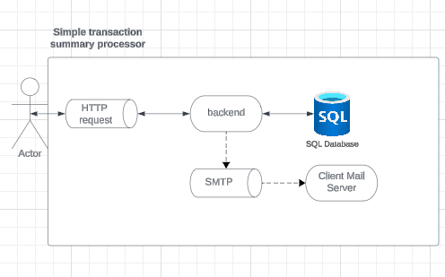
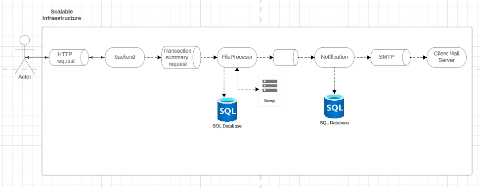
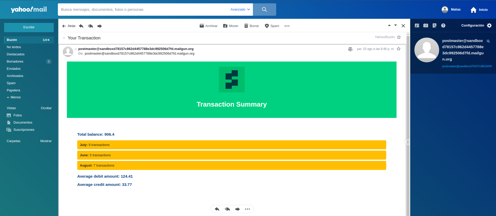
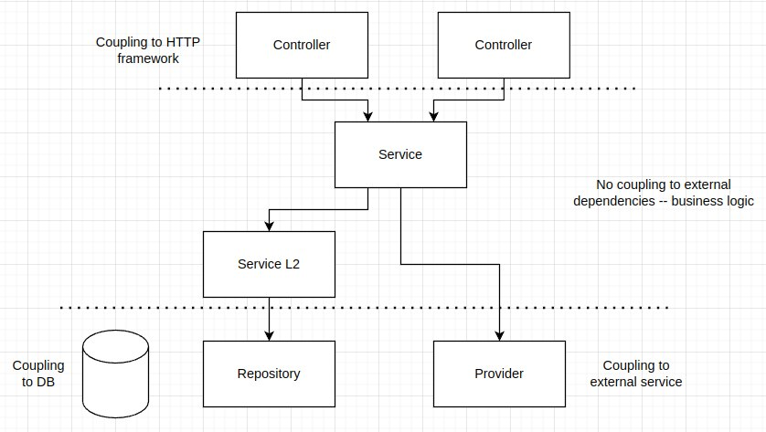

# Stori Challenge

## System Design Overview

When starting the challenge, the first step was to design the solution before beginning the implementation. During this process, several design decisions and assumptions were made to define the scope of the challenge effectively.

### Design Decisions and Assumptions

- **Interface**: The system uses an HTTP server as the interface to the client. This choice is based on its widespread use and ease of integration with other systems.
- **Data Storage**: Transaction file data is not saved in the database to avoid duplication of information.
- **File Format**: The transaction file is expected to have the format `<user_account>.csv`.
- **File Size**: It is assumed that the transaction file is not too large and can be loaded into system memory.

### Initial System Design

Based on the above assumptions, the following initial system design was proposed:



In this design:
- The system handles transaction files and processes them as they come.
- The architecture is simplified to fit within the expected scope and time constraints.

### Proposed Scalable Design

To ensure scalability and handle potential future requirements more efficiently, a more complex system design could be implemented:



In this proposed model:
- **Scalability**: Multiple instances of components such as the File Processor or Notification System are used to enhance scalability.
- **Load Distribution**: The architecture allows for distributing the load across several instances, improving performance and reliability.

### Conclusion

The decision to implement the initial design was based on the need to complete the work within the expected timeframe. However, the proposed scalable design offers a more robust and scalable solution for future expansion and performance optimization.


## Configuration
The server configuration is in config.yml file. There you can change the following parameters:

```yaml
server:
 host: #localhost
 port: 8080
database:
  host: db
  port: 5432
  schema: Stori
  userID: user
  pass: user
smtpserver:
  host: smtp.example.org
  port: 25
  password: my-password
  from: my-email
emailtemplate:
  path: /project-package/mail_template/summary.html
transactionfile:
  directory: /project-package/transactions_files/
```
the default config is used for a dockerized env but you will need to complete the smtp server data so that the server works well. In case you want to run the server locally change host in database configuration to localhost


## How to run it

It is important to note that both the dev/ environment and the tests require the database to be running correctly. That is why in case of error it is recommended to first raise the database with the following command:
```
#Dev or test
$> sudo docker compose -f ./docker-compose-dev.yml up db
```
or 
```
$> sudo docker compose up db
```
To then deploy any of the environments or run the tests


### Running dev environment

I highly recommend using this environment to test the app, as it provides a reliable setup. For testing the email functionality, I used a free SMTP server from [Mailgun](https://www.mailgun.com/). To make it work, ensure you have the correct SMTP server configuration. Once configured, you can use the "test" account, which corresponds to the CSV file, to send a summary by email.

1. First, to build run: 
```
$> sudo docker compose -f ./docker-compose-dev.yml build
```
1. Then to start dev environment execute(take into account that a valid configuration must be used so that the server works well):
```
$> sudo docker compose -f ./docker-compose-dev.yml up db back adminer swagger-ui
```
it will start the postgress database on port 5432, an [adminer](localhost:8081) to access the db on port 8081 (user:user, pass:user), the [API](localhost:8080) web server on port 8080 with hot reload thanks to [Air project](https://github.com/cosmtrek/air) and a http [server](localhost:8082) with the swagger doc on port 8082

### Running prod environment
1. First, to build run: 
```
$> sudo docker compose build
```
2. Then to start dev environment execute:
```
$> sudo docker compose up
```
it will start the postgress database and the API web server on port 8080

### Running test
Before running the tests, make sure you have a clean instance of the database running. For that we can execute:
```
$> sudo docker compose -f ./docker-compose-dev.yml stop db
```
```
$> sudo docker compose -f ./docker-compose-dev.yml rm db
```
to make sure we don't have any dirty database

then run

```
$> sudo docker compose -f ./docker-compose-dev.yml build
```
```
$> sudo docker compose -f ./docker-compose-dev.yml up db
```

Once the database is accepting connections run

```
$> sudo docker compose -f ./docker-compose-dev.yml up test
```
## Results
With the provided csv file. Once you trigger the system, you will receive a mail like this.


## Endpoints

### Transactions

- #### POST /transactions/summaries
    ##### Params
    - In body:
        ```json
        {
          "account": "string",
          "email": "string"
        }
        ```
- ##### Response
    - 
        ```json
        {
          "message": "Email sent successfully",
          "status": "success"
        }
        ```        

## Code Design


The code is separated in three main layers:

- Controllers: 
  Isolate all http protocol and is coupling to the http framework.

- Services
  Encapsulates all business logic and try not to have externals dependencies. They can interact with each other.

- Repositories
  Isolate all the interaction with the database and is coupling to the database.
  

## Tools/Tech used
- SQL Database:  [PostgreSQL](https://www.postgresql.org/)
- Programming languaje:  [Golang:1.22.5](https://go.dev/)
- Conteiners: 
  - [Docker](https://docs.docker.com/)
  - [Docker-compose](https://docs.docker.com/compose/)
- SQL manager:  [Adminer](https://www.adminer.org/)
- Documentation: 
  - [swagger](https://swagger.io/)
  - [go-swagger](https://github.com/go-swagger/go-swagger)
- Linter:  [golangci-lint](https://golangci-lint.run/)
- ORM:  [Gorm](https://gorm.io/)
- Go Web Framework:  [Gin](https://gin-gonic.com/)